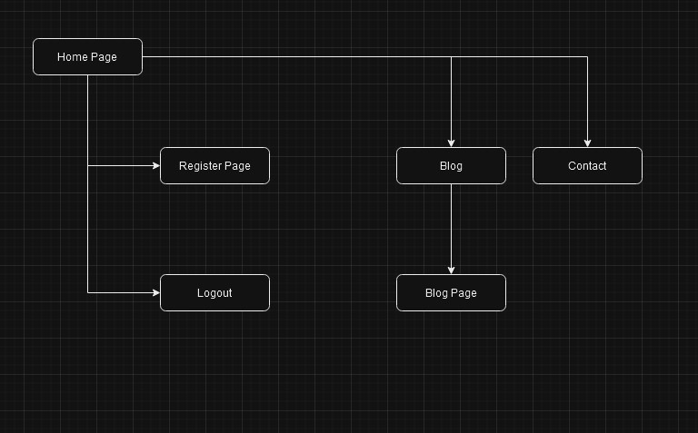
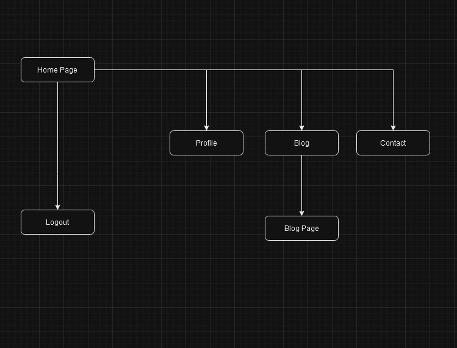
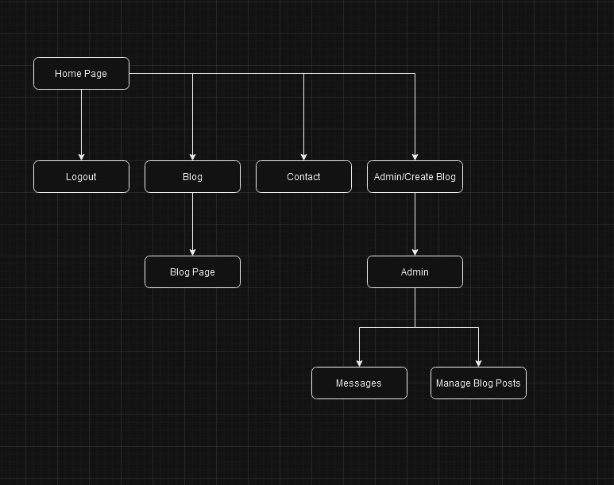
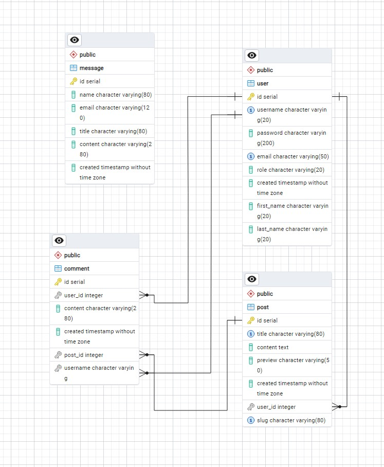
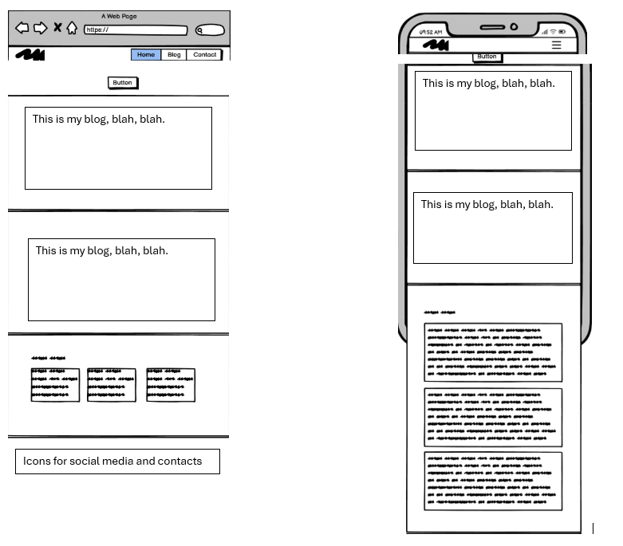
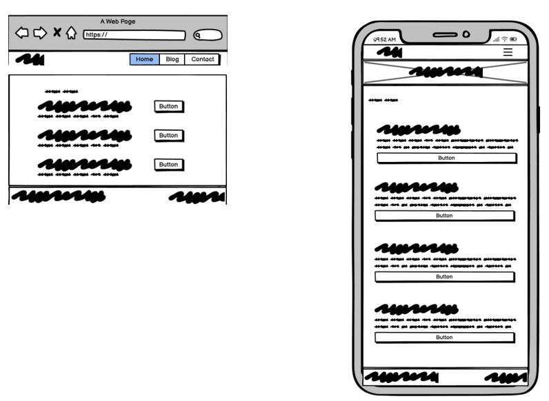
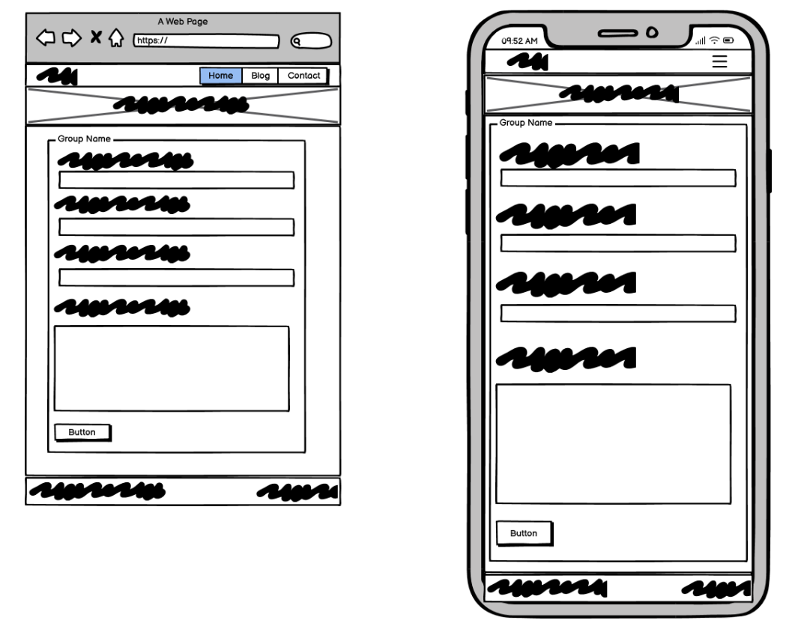
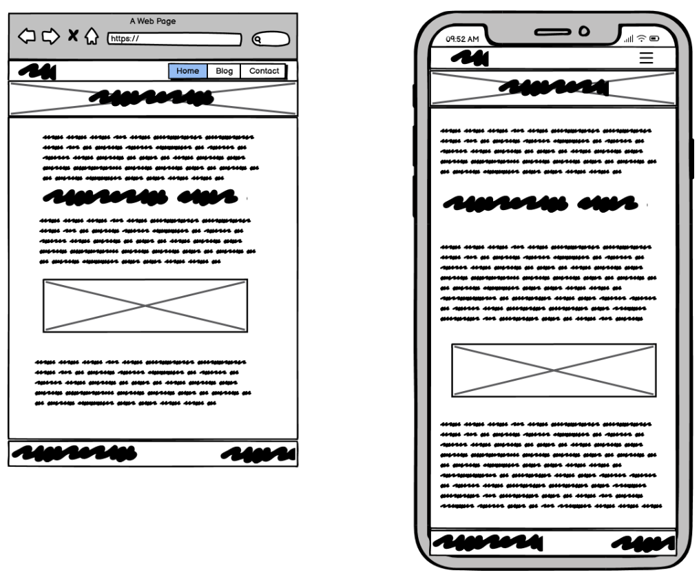
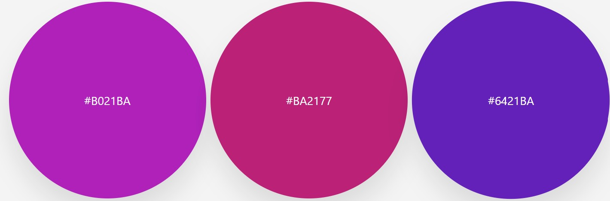

# Spanish Resources

Spanish Resources was developed by me for me and for people teaching and learning Spanish to share useful resources, opinions and thoughts about these. Users are able to register an account and send messages to me using the form on the contact page. As an admin of the site I am able to Create, Edit and Delete blog posts. The website employs a feature rich content editor for use with writing blog posts allowing the use of font sizing, italics, bold fonts, lists, externally hosted images etc

                    IMAGE OF THE WEBSITE WILL GO HERE

The images were sourced from here [AmiResponsive] (https://ui.dev/amiresponsive)

# Project Overview

Spanish Resources is a blog-style site built using **Python**, **Flask**, **SQLAlchemy**, **Bootstrap 5**, and **JavaScript**.

- User authentication and CRUD functionality is handled by a relational backend database (**PostgreSQL**)

Spanish Resources is my submission for the Milestone 3 Project by Code Institute in partnership with City of Bristol College for the Level 5 Diploma in Full Stack Web Application Development.

The choice to make this project was influenced by my desire to develop a resource information platform for Spanish teachers and learners to spread information about useful resources available freely on the Internet or easily available from purchase site.

# README Contents

<details>
<summary>Table of Contents </summary>

- [Project Overview](#project-overview)
- [UX Development](#ux-development)
  - [Strategy](#strategy)
    - [Project Goals](#project-goals)
    - [User Demographic](#user-demographic)
    - [User Stories](#user-stories)
    - [Scope](#scope)
- [Structure](#structure)
  - [Topology](#topology-diagrams)
  - [Database Schema](#database-schema--structure)
- [Skeleton](#skeleton)
  - [Wireframes](#wireframes)
  - [Colour Schemes](#colour-scheme)
  - [Typography](#typography)
  - [Imagery](#imagery)
- [Features](#features)
  - [Multi-Page Elements](#multipage-elements)
  - [CRUD Table](#crud-table)
  - [Defensive Programming](#defensive-programming)
  - [Error Handling](#error-handling)
- [technologies Used](#technologies-used)
- [Future Implementation](#future-implementation)
- [Testing](#testing)
  - [Bugs, Issues and Solutions](#bugs-issues-and-solutions)
- [Deployment and Local Development](#deployment-and-local-development)
  - [Deployment](#deployment-to-heroku)
  - [Cloning](#cloning-the-repo)
  - [Forking](#forking-the-repo)
  - [VENV Help](#create-virtual-environment)
  - [Database Help](#create-and-migrate-database)
- [Credits](#credits)
  - [Content](#content)
  - [Media](#media)
  - [Acknowledgements](#acknowledgements)
</details>

# UX Development

## Strategy

### Project Goals

- Develop a full stack website
- Website needs to include full CRUD functionality
- Guests will be able to view and navigate public sections of the website
- Guests will be able to send a message to the admins using the form on the contact page
- Registered users will be able to add comments to articles
- Admins will be able to create, edit and delete blog posts
- Admins will be able to read and delete messages sent by the contact form
- Present information in an easy to read manner
- Implement responsive design methodologies
- Provide the option for users to create an account and login/logout
- Provide registered Admin users CRUD functionality in appropriate sections of the website
- Implement defensive programming to prevent accidental deletion of data
- Handle errors to aid the users in understanding the cause of the issue and getting them back on track

### User Demographic

- Students of Spanish as a foreign language
- Parents of bilingual children or children learning Spanish
- Teachers of Spanish as a foreign language

### User Stories

#### First Time Visitor Goals

As a first time visitor I want to be able to:

- Immediately understand the purpose of the website
- Immediately recognise how to use and navigate the website
- Browse the articles available
- Register for an account

#### Registered/Returning Visitor Goals

As a registered or returning visitor I want to be able to:

- Easily find new content
- Send a message to the site owner/admin
- Comment on blog posts
- Browse new blog posts

#### Site Admin Goals

As a site admin I want to be able to:

- Be able to add a new blog post
- Be able to edit existing blog posts
- Be able to delete exisiting blog posts
- View messages sent via the contact form
- Delete messages sent via the contact form

### Scope

#### Functionality Planning

This Viability Analysis evaluates the project’s scope by assessing the features I aim to include. By conducting this analysis, I can prioritize the most critical functionalities while postponing less essential features for future development. This approach ensures a focused and efficient workflow, allowing the project to meet its key objectives without unnecessary delays.

This is the table that shows the features:

| #   | Feature                                | Importance | Viability |
| --- | -------------------------------------- | :-------: | :-------: |
| 1   | View, Create, Edit & Delete Blog Posts |     5      |     5     |
| 2   | Registration Functionality             |     5      |     5     |
| 3   | Login/Logout Functionality             |     5      |     5     |
| 4   | Contact Form                           |     5      |     5     |
| 5   | Read/Delete Contact Form Submissions   |     5      |     5     |
| 6   | Blog Commenting Functionality          |     2      |     5     |
| 7   | Display Suggested Articles             |     1      |     2     |
| 8   | Share Blog Posts on Social Media       |     2      |     4     |
| 9   | Log User Activity                      |     2      |     2     |
| 10  | User Profile Page Functionality        |     2      |     5     |
| 11  | Search for Blog Posts                  |     1      |     4     |
| 12  | User Action Validation                 |     5      |     5     |
| 13  | Manage my profile                      |     1      |     4     |
| 14  | Comment on Articles                    |     4      |     4     |

For this project, I'm embracing the concept of a Minimally Viable Product (MVP) by focusing on the essential core functionality needed to meet the minimum required specifications. Rather than overwhelming the initial development sprint with too many features, I’ll strategically implement only the most crucial ones first.

To ensure a solid foundation, I will prioritize features 1, 2, 3, 4, 5, and 12 in the first sprint. This approach allows for a streamlined, efficient development process while ensuring that the application delivers its key functionalities right from the start.

#### Functionality Requirements

- Cohesive and visually polished UI design aligned with the site's overall theme

- Well-structured and visually appealing blog post presentation

- Rich text editor supporting advanced content creation features

- Secure user authentication system with login and logout capabilities

- Profile management functionality for user personalization

- Full Create, Read, Update, and Delete (CRUD) support for blog content

- Implementation of defensive programming techniques to protect against invalid or malicious input

- Robust error handling with clear and appropriate user feedback

# Structure

## Topology Diagrams

The following diagrams outline the user-accessible pages based on session state (Guest, Logged-in Guest, or Admin). Any pages not represented in these diagrams are intentionally restricted and not accessible to users in the corresponding session state.

- **Guest**

Unauthenticated users can only access public-facing pages such as the home page, registration and login pages, the blogs and the contact page. They have no access to user-specific or administrative features.



- **Logged in user**

Authenticated users can access all guest features, plus profile management, user dashboards, and any other user-specific content. Administrative pages remain restricted.



- **Administrator**

Admins have full access to both user and administrative areas of the application. This includes content management, user oversight, and configuration tools not available to regular users.



## Database Schema & Structure

The Spanresources website operates on a single relational database comprising multiple tables. These include tables for user management, blog posts, comments, and messages.

All users have permission to create and read data; however, only administrators are authorized to modify or delete existing records. The Entity Relationship Diagram (ERD) below illustrates the structure and relationships between these tables.

An ERD (Entity Relationship Diagram) is a visual representation of a database’s structure, showing how tables (entities) are related to each other through keys and relationships.



# Skeleton

## Wireframes

- Homepage

The homepage of Spanish Resources provides visitors with an inviting overview of the platform, featuring a clean, blog-style layout that highlights recent articles and featured content. It serves as the entry point for users to discover high-quality resources curated for Spanish teachers and learners. Clear navigation and user-friendly design ensure quick access to blog posts, user login, and the contact page.



- Blog Page

The blog page displays a collection of posts, each summarizing different tools, materials, or strategies for learning and teaching Spanish. Posts are listed chronologically or by relevance, and each includes a brief excerpt, author details, and a "Read More" link. This section encourages exploration and makes it easy for users to browse through categorized content tailored to their needs.



- Contact Page

The contact page allows users to reach out with inquiries, feedback, or suggestions. It features a simple form that collects the user’s name, email, and message, ensuring seamless communication between the site's visitors and administrators. This page reinforces the site’s goal of community-building and resource-sharing by encouraging user participation.



- Article Page

The article page presents the full content of a selected blog post. It includes a detailed write-up on the chosen resource or topic, accompanied by relevant images or links. Registered users can interact with the post through options such as editing (if they are the author), commenting, or bookmarking. The layout prioritizes readability, offering a focused space for deeper engagement with the content.



## Colour Scheme

For the colour palette, I selected three primary hues—#B021BA, #BA2177, and #6421BA—to establish a cohesive and visually engaging design throughout the site.



The images were sourced from here [Imagecolor] (https://imagetocolor.com/color-palette-generator)

## Typography

For typography, I’ve chosen to use a single imported font—Roboto from Google Fonts—for headings and interactive elements to draw user attention to key areas. System default fonts are used elsewhere to enhance performance and reduce load times.

## Imagery

The site features high-quality stock images sourced from [Unsplash](https://unsplash.com/) to enhance visual appeal and support content contextually.

# Features

An overview of the key components and how they are implemented throughout the website to enhance functionality and user experience.

## Multipage Elements

The website is structured across multiple interconnected pages, each incorporating consistent design elements to ensure a seamless user experience. Core components such as the navbar—with a site logo and intuitive navigational links—and the footer containing contact details are present throughout. The homepage offers an engaging introduction with a hero section, overview of services, interactive content blocks, and previews of recent blog posts. The blog page features a chronological list of articles with pagination and user comment functionality. A contact page allows users to send messages directly to the admin, with forms that smartly autofill user details when available. For authenticated users, an admin dashboard provides a comprehensive content management interface, including tools to create, edit, and delete blog posts, as well as manage incoming messages.

**Navbar**

- Logo
- Navigational Links

**Footer**

- Contact Information

**Home Page**

- Hero
- About Section
- What I do section with Hover effects
- Latest Blogs with links to specific post
- Experience

**Blog**

- Chronologically sorted Blog Posts
- Pagination
- Comments on Articles

**Contact**

- Form to send Admin/Owner a message
- Form will autofill where possible using information from user session

**Admin Dashboard**

- Ability to create posts using a feature rich text editor
- Ability to edit posts using a feature rich text editor
- Ability to Delete posts
- Ability to View Messages
- Ability to Delete Messages


## CRUD Table

Below is a table of CRUD functionality for each relevant page:

| Page            | Create            | Read                                      | Update                          | Delete            |
| --------------- | ----------------- | ----------------------------------------- | ------------------------------- | ----------------- |
| Home            |                   | Fetch 3 latest blog posts                 |                                 |                   |
| Blog            |                   | Fetch paginated blog posts                |                                 |                   |
| Contact         | Submit Message    |                                           |                                 |                   |
| Admin           | Create Blog Posts |                                           |                                 |                   |
| Edit Post       | Submit Comment    | Read Comments                             | Edit Article content            |                   |
| Blog Management |                   |                                           |                                 | Delete Blog Posts |
| View Messages   |                   | Read messages submitted from contact page |                                 | Delete Messages   |
| Login           |                   | Check password hash                       |                                 |                   |
| Register        | User profile      |                                           |                                 |                   |


## Defensive Programming

From the start, this website was built with **defensive programming** in mind — that means writing code in a way that helps prevent mistakes and protect the site from unexpected issues. To help keep the site secure, I made sure that pages requiring special access first check the user's **role** and **session**. A **user role** is a label that defines what a person can or can't do on the site — for example, an **admin** can edit or delete content, while a **regular user** can only view it. If someone tries to access a page they’re not allowed to see, the site redirects them to a different page instead.

## Error Handling

As errors might occur, the following error messages were introduced to warn the user and redirect them:

- 400: Bad request error
- 404: Not found error
- 408: Request Timeout Error
- 500: Internal Server Error

# Project Technologies

Below is a list of the languages, frameworks, and tools used in building the Spanish Resources website.

**Frontend**

- HTML5 – Used to define the structure and layout of the web pages.

- CSS3 – Applied for styling and enhancing the visual presentation of the site.

- JavaScript – Used sparingly to add dynamic behavior and enhance user interaction where necessary.

- Roboto (Google Fonts) – The primary typeface for headings and interactive elements, enhancing readability and focus.

- [Bootstrap 5](https://getbootstrap.com/) – A responsive front-end framework used to streamline layout design and UI components.

- [Flowbite](https://flowbite.com/icons/) – Provided a collection of accessible SVG icons used throughout the UI.

- [ImgBB](https://imgbb.com/) – A third-party platform used to host and manage images for blog articles.

- [CKEditor](https://ckeditor.com/) – An embedded rich text editor integrated for creating and formatting blog posts.


**Backend**

Python – The core programming language used to handle all server-side logic.

- [Flask](https://flask.palletsprojects.com/en/3.0.x/) - A lightweight Python web framework used to build the application’s server and route handling.

- [SQLAlchemy](https://www.sqlalchemy.org/) – A powerful ORM (Object Relational Mapper) used for interacting with the PostgreSQL database in a Pythonic way.

- [Flask Migrate](https://flask-migrate.readthedocs.io/en/latest/) – A tool for managing database schema changes using Alembic and SQLAlchemy.

- [PostgreSQL](https://www.postgresql.org/) – A robust, open-source relational database used to store user data, blog content, and messages.

- [Jinja](https://jinja.palletsprojects.com/en/3.1.x/) – A templating engine used to dynamically generate HTML content from backend data.

- [Werkzeug](https://werkzeug.palletsprojects.com/en/3.0.x/) – A WSGI utility library that supports Flask’s request and response handling.

- [pip](https://pypi.org/project/pip/) – Python’s package installer used to manage project dependencies.

- [Git](https://git-scm.com/) – A version control system used to track code changes and collaborate during development.

- [Heroku](https://dashboard.heroku.com) – A cloud platform used to deploy and host the live version of the web application.

- [CloudConvert](https://cloudconvert.com/) – Used for converting and optimizing images and media assets during content preparation.

- [Balsamiq](https://balsamiq.com/) – A wireframing tool used during the planning stage to mock up page layouts and UI structure.


# Future Implementation

**Planned enhancements for future versions of the application include:**

- Expanding user profiles to allow users to add and edit personal information such as date of birth and other optional details.

- Enabling registered users to delete their own accounts through the user interface.

- Supporting image uploads for users, particularly for use in articles or profiles.

- Developing an admin interface to manage and moderate registered user accounts.

- Providing tools for admins to review and moderate comments submitted on blog articles.

# Testing

I will use the Code Institute Linter "https://pep8ci.herokuapp.com/"

## Bugs, Issues and Solutions

# Deployment and Local Development

## Deployment to Heroku

This project is deployed to Heroku directly from this GitHub repository. As a result, the live site is always in sync with the latest codebase, ensuring that the deployed version accurately reflects the current state of the repository.

## Cloning and Deployment Instructions

To clone and deploy this project locally or on Heroku, follow the steps below. Note that some steps may vary slightly depending on your development environment:

To clone and deploy this project locally or on Heroku, follow the steps below. Note that some steps may vary slightly depending on your development environment:

1. **Clone the Repository**  
   Clone this repository to your local machine using Git:
   ```bash
   git clone https://github.com/your-username/your-repository.git

## Cloning the Repository

## Forking the Repository

## Creating a Virtual environment

## Create and migrate Database


# Credits

## Content

Blog article content was generated by me with help for some blogs from [ChatGPT](https://openai.com/index/chatgpt/)

## Media

Images used on the website were sourced either from my own photos or from [Unsplash](https://unsplash.com/), the Favicon was sourced from [Favicon.io](https://favicon.io/)

## Acknowledgements

Thanks again to my Mentor, Juliia, for provided continuous feedback on my ideas and progress as well as the teams at Code Institute and City of Bristol College for their ongoing support.