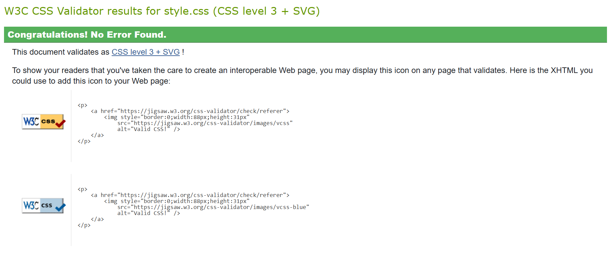
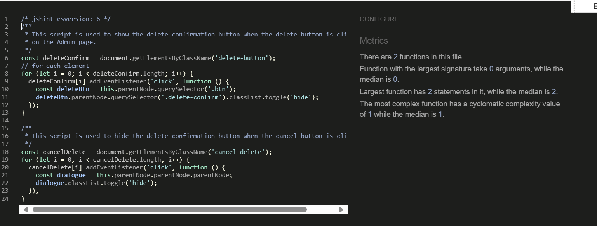
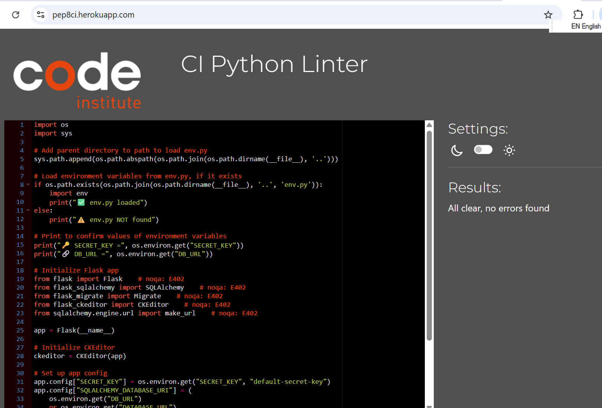

# Testing Documentation

# Validation Results

## W3C HTML Validator Results

- [Homepage](https://validator.w3.org/nu/?doc=https%3A%2F%2Fspanresources-b8f48e645d95.herokuapp.com%2F)
- [Blog Page](https://validator.w3.org/nu/?doc=https%3A%2F%2Fspanresources-b8f48e645d95.herokuapp.com%2Fblog)
- [Blog Post Page](https://validator.w3.org/nu/?doc=https%3A%2F%2Fspanresources-b8f48e645d95.herokuapp.com%2Fblog%2Fla-reina-del-sur-%28tv-series%2C-mexico%29)
- [Contact Page](https://validator.w3.org/nu/?doc=https%3A%2F%2Fspanresources-b8f48e645d95.herokuapp.com%2Fcontact)
- [Login Page](https://validator.w3.org/nu/?doc=https%3A%2F%2Fspanresources-b8f48e645d95.herokuapp.com%2Flogin)
- [Register Page](https://validator.w3.org/nu/?doc=https%3A%2F%2Fspanresources-b8f48e645d95.herokuapp.com%2Fregister)

1. HOMEPAGE W3C Validator Results: The HTML validator results show only informational messages and a minor warning, none of which indicate actual errors or issues that would affect the functionality or display of your site. The "trailing slash" notices relate to optional syntax preferences in HTML5, and the "button role" warning is simply about redundant code. Since these do not impact how the site performs or appears, making changes at this stage would not be time efficient, especially when the priority is likely on developing or refining content and features rather than minor formatting optimizations.

2. Blog Page W3C Validator Results: The HTML validator results for the blog page are consistent with those from the main page—primarily informational notices and one non-critical warning. The "trailing slash on void elements" messages are related to self-closing tags like <meta />, which are valid in XHTML but unnecessary in HTML5 and can cause minor interpretation issues if not carefully formatted. The "button role is unnecessary" warning highlights redundant use of the role="button" on a native <button> element, which already has this role inherently. These points are about stylistic or semantic refinements rather than functional problems. At this stage, when the page renders correctly and performs as expected, prioritizing these minor issues would not be time-effective, especially if your focus is on delivering features and content.

3. Blog Post Page W3C Validator Results: The validator results for the blog post page include similar minor issues as seen on other pages—mostly informational and a few low-impact warnings. The repeated notices about “trailing slashes on void elements” refer to XHTML-style syntax like <meta />, which is unnecessary in HTML5 but doesn’t break functionality. The redundant role="button" on a native <button> is also a stylistic inefficiency. Two warnings suggest that certain **section** elements lack headings (h2 and h6), which affects semantic clarity for screen readers but doesn't hinder visual layout or basic usability. The most notable issue is a “stray end tag </form>,” which could indicate a structural HTML error if a form was improperly closed. However, if the form still behaves correctly and the layout isn’t broken, it may not need immediate attention. Overall, while these findings are worth noting for future refinement, they are not critical blockers and can be safely deferred if your priority is functionality and content delivery.

4. Contact Page W3C Validator Results: During the HTML validation of the contact page, several informational messages and one warning were identified. The informational messages highlight that the use of trailing slashes on void elements (such as <meta />) is unnecessary in HTML5 and can cause issues when combined with unquoted attribute values. These trailing slashes do not affect rendering but are best avoided for cleaner and more compliant code. Additionally, there was a warning regarding a button element where the role="button" attribute was used unnecessarily since the element is already a native button, making the role redundant. Removing this attribute improves semantic clarity and accessibility.

5. Login Page W3C Validator Results: Similar to the Contact page, the validator reports informational messages regarding trailing slashes on void elements like <meta> tags. These trailing slashes are harmless but unnecessary in modern HTML5 and can cause issues with unquoted attribute values. The warning about the role="button" attribute on a native <button> element is also present here, highlighting that it is redundant and can be removed for cleaner code. None of these findings represent critical errors, so prioritizing other development tasks over correcting these minor code style points is advisable at this stage.

6. Register Page W3C Validator Results: The HTML validation for the registration page reported several informational notes and one warning. The informational notes indicate that trailing slashes on void elements like <meta /> are unnecessary in HTML5 and can cause issues, especially when used with unquoted attribute values. Although these trailing slashes don’t impact how the page renders, it’s best practice to omit them for cleaner and more standards-compliant markup. Additionally, a warning was flagged for a button element that includes a role="button" attribute, which is redundant because the native <button> element already has that role implicitly. Removing this attribute helps improve semantic accuracy and accessibility.

## W3C CSS Validator Results

My CSS validated with no errors, see 

## JSHint Results

During linting, JSHint issued warnings about the use of const and let declarations, indicating these are ES6 features and require specifying the JavaScript version for proper support. This occurs because JSHint defaults to an older JavaScript version and doesn’t recognize ES6 syntax unless explicitly told to. To resolve this, the directive /* jshint esversion: 6 */ was added at the top of the JavaScript file, informing JSHint to treat the code as ES6. This change silenced the warnings and ensured the linter correctly understood and accepted modern JavaScript syntax, improving code validation without affecting functionality.

## PEP8 Validation

I used the Code Institute Linter 

After running the code through style and syntax checks, all previous errors have been resolved. Issues such as excessive blank lines and lines exceeding the recommended length were fixed to adhere to PEP8 standards. Additionally, the E402 error (module-level import not at top of file) was addressed by adding # noqa: E402 comments to specific import lines that must remain after initial setup code, allowing the project to run correctly without compromising style checks. Currently, no errors or warnings remain, ensuring clean and maintainable code.

## Lighthouse Results

Images with Lighthouse results

- [Home - Mobile](documentation/lighthouse-results/lighthousehomemobile.png)
- [Home - Desktop](documentation/lighthouse-results/lighthousehomepc.png)
- [Blogpost - Mobile](documentation/lighthouse-results/lighthouseblogpostmobile.png)
- [Blogpost - Desktop](documentation/lighthouse-results/lighthouseblogpostpc.png)
- [Blog - Mobile](documentation/lighthouse-results/lighthouseblogmobile.png)
- [Blog - Desktop](documentation/lighthouse-results/lighthouseblogpc.png)
- [Contact - Mobile](documentation/lighthouse-results/lighthousecontactmobile.png)
- [Contact - Desktop](documentation/lighthouse-results/lighthousecontactpc.png)
- [Login - Mobile](documentation/lighthouse-results/lighthouseloginmobile.png)
- [Login - Desktop](documentation/lighthouse-results/lighthouseloginpc.png)

## a11y Contrast Test Results

## Wave Test Results

# Responsiveness

## Responsive Design Testing

# Manual testing

# User Story testing

## First Time Visitor Goals

## Registered/Returning Visitor Goals

## Site Admin Goals